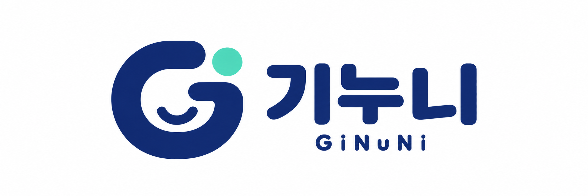

# GiNuNi · 화면해설 대본 도구



영상과 SRT 자막, 직접 입력, 또는 음성 분석으로 대사를 준비하고, 화면해설작가가 검수한 뒤 한컴오피스용 HWPX 대본으로 저장하는 도구입니다. Windows 설치형 앱과 별도의 웹 작업실을 제공합니다.

## 설치 없이 쓰는 웹 작업실

[기누니 웹 작업실](https://buildergarlic.github.io/ginuni/) · [웹 사용법·제한·개발·배포 안내](docs/WEB_APP.md)

대회 서비스 링크에는 위 웹 작업실 주소를 사용하세요. 실제 배우의 대화가 있는 공개 영화 샘플로 음성 인식 결과와 타임코드를 비교하고 직접 수정할 수 있습니다.

- 회원가입 없이 **Shy Guy (1947)**의 실제 영어 대화 60초를 엽니다. 미리 실행한 AI 초안과 시간에 맞춰 표시되는 대본 자막이 있으며, **샘플 음성 AI 다시 분석**으로 현재 브라우저에서 직접 전사할 수 있습니다. [공개 영상 출처와 권리 안내](docs/SAMPLE_MEDIA.md), 참고 자동 자막과 비교, 대사 구간 재생을 제공합니다. 참고 자막도 오인식이 있어 정확한 정답으로 간주하지 않습니다.
- 무료 브라우저 AI로 최대 3시간 영상의 대사 초안을 만듭니다. 한국어와 영어·일본어·중국어·스페인어·프랑스어·독일어·이탈리아어·포르투갈어·러시아어를 선택할 수 있습니다. 지원되는 브라우저·코덱에서는 파일을 60초씩 순서대로 읽고 분석하므로 100MB 파일 제한이 없습니다. 구간별 읽기를 지원하지 않는 환경의 대체 분석은 5분·100MB 이하로 제한됩니다. 처음에는 선택 언어에 맞는 모델 다운로드가 필요하며 분석은 사용자 기기에서 실행됩니다.
- 한국어의 **자동** 분석은 지원 GPU에서 Whisper large-v3-turbo(첫 다운로드 약 1.62GB), 그 외 환경에서 CPU용 Whisper small(약 255MB)을 선택합니다. **정밀 / 호환**을 직접 고를 수도 있습니다. 한국어로 언어를 고정하고 발화 구간을 검출한 뒤 분석하며, 반복·문장 잘림이 의심되면 짧게 재분석하고 확인할 행을 표시합니다. 영상·음성을 서버에 보내지 않습니다. 사투리의 단어, 고유명사, 겹친 대사와 시간은 원음을 들으며 검수해야 합니다.
- **한국어로 번역**은 위 9개 외국어 대사의 원문과 타임스탬프를 보존한 채 한국어 초안을 만듭니다. 원문·한국어 보기 전환, 번역 편집·검수·초안 복원, 선택한 언어의 영상 자막과 SRT·HWPX 내보내기를 지원합니다. 처음 번역할 때 약 640MB 모델을 내려받으며 PC 사용을 권장합니다. API 키가 필요 없고 대사를 서버에 보내지 않습니다. 전문어·문맥 등 번역 오류는 직접 확인해야 합니다.
- 대사·해설·타임코드를 수정하고 검수한 뒤 HWPX, SRT, JSON 백업을 내려받습니다. 대본은 현재 브라우저에 최대 10개 저장되며 원본 영상은 다시 선택해야 합니다.
- 설치형 프로젝트와 웹 JSON 백업은 별도 형식입니다. 웹과 설치형 사이에서 프로젝트를 자동 동기화하거나 그대로 가져오는 기능은 없습니다.

웹 개발은 `npm run dev:web`, 배포용 빌드는 `npm run build:web`를 사용합니다. 아래 설치 파일과 로컬·OpenAI 엔진 안내는 Windows 설치형 기준입니다.

## 파일럿 베타 다운로드

[GiNuNi v0.6.0-beta.3 설치 파일 내려받기](https://github.com/buildergarlic/ginuni/releases/download/v0.6.0-beta.3/ScreenDescriptionScriptMaker-0.6.0-beta.3-Setup.exe)

- 위 링크는 `v0.6.0-beta.3` 태그의 GitHub Actions 릴리스가 성공한 뒤 사용할 수 있습니다. 게시 전에는 [GiNuNi Releases](https://github.com/buildergarlic/ginuni/releases)에서 기존 배포본을 이용하세요.
- Windows 10/11 x64용 설치 파일입니다. 실제 파일 크기는 게시된 Releases 자산에서 확인하세요.
- 새 버전과 체크섬은 [GiNuNi Releases](https://github.com/buildergarlic/ginuni/releases)에서 확인할 수 있습니다.
- 현재 설정은 인증서가 없으면 무서명 베타 설치본을 게시합니다. 릴리스의 실제 서명 상태를 확인하고, 무서명이면 Windows SmartScreen이 표시될 수 있으므로 공식 Releases 출처와 SHA-256을 확인한 뒤 실행하세요.

## 현재 버전

- 릴리스 대상 버전: `0.7.0-beta.2` 외화 자막 작업 베타 (공개 다운로드 링크는 기존 배포본)
- 운영체제: Windows 10/11
- 입력 길이: 최대 3시간
- 기본 언어: 한국어
- 전사 엔진: 로컬 `whisper.cpp`(기본), 로컬 `whisper.cpp + sherpa-onnx` 화자 분리(실험), 또는 OpenAI `gpt-4o-transcribe-diarize`
- 출력: 첨부 양식을 재현한 5열 HWPX, 그리고 검수한 대사 행 기준 SRT 자막

AI 결과는 검수 가능한 초안입니다. 중요한 납품 전에는 반드시 앱에서 영상을 재생하며 대사와 타임코드를 확인하세요.

## 사용자 빠른 시작

**한국어 자막이 있는 외화:** 새 프로젝트에서 **자막 파일로 시작** → 로컬 영상과 사용 권리 확인 → **프로젝트 만들고 자막 선택** → SRT 미리보기 → 시간차 확인 → **새 초안 적용**으로 시작하세요. API 키나 음성 분석 모델이 필요하지 않습니다. 자막이 없으면 **대사를 직접 입력**에서 영상 구간과 첫 문장을 넣을 수 있습니다. 자세한 범위와 검증은 [외화 자막 작업 안내](docs/SUBTITLE_WORKFLOW.md)에 있습니다.

**기존 음성 분석으로 시작:**

1. 설치 파일을 실행합니다.
2. 기본 **내 PC에서 분석**을 사용합니다. 처음 한 번 약 181MB Whisper 모델을 내려받으며 API 키와 사용료가 없습니다.
   로컬에서 화자를 나눠야 하면 **내 PC에서 분석 + 화자 분리(실험)**를 선택합니다. sherpa 런타임과 약 41MB 화자 모델은 설치본에 포함되어 설치 후 인터넷이 필요 없습니다.
3. **새 대본 만들기 → 음성에서 만들기**에서 로컬 영상 또는 사용 권한이 있는 유튜브 링크를 선택합니다.
4. 프로젝트를 열고 **작업 도구 → 사용 권리와 외부 전송 설정**에서 필요한 확인을 저장합니다. 도구 창을 닫고 **로컬 음성 분석 시작**을 누릅니다. 선택한 분석 방식에 따라 버튼 이름이 달라집니다.
5. 왼쪽 영상과 오른쪽 대본을 함께 보며 수정합니다. 대사·해설을 누르면 그 시점으로 이동합니다. **확인 완료 · 다음**으로 한 줄씩 검수합니다.
6. 오른쪽 위 **대본 내보내기 → HWPX 내보내기**에서 저장 폴더를 선택합니다.
7. 자막이 필요하면 같은 메뉴의 **SRT 내보내기**를 선택합니다. 대사 행만 저장됩니다.

로컬 또는 OpenAI 분석이 실패하면 오류 코드·실패 단계·해결 방법을 확인할 수 있습니다. `진단 파일 저장`으로 음성·대사·API 키 없이 오류 원인을 저장해 문의할 수 있으며, 손상된 모델은 `로컬 모델 복구`로 다시 설치할 수 있습니다.

앱의 **About GiNuNi**에서 버전·자동 업데이트·BuilderGarlic 연락처·GitHub 저장소를 확인할 수 있고, **개발자 후원** 메뉴에서 [BuilderGarlic GitHub Sponsors](https://github.com/sponsors/buildergarlic) 후원 단계를 선택할 수 있습니다.

프로젝트는 Windows 문서 폴더의 `화면해설 대본 도구\Projects`에 자동 저장됩니다. HWPX와 SRT는 같은 제목이 있으면 `V01`, `V02`처럼 새 버전으로 저장되고 기존 파일을 덮어쓰지 않습니다.

앱의 **사용법** 메뉴에는 큰 글씨의 3단계 안내, 클릭 이동 연습 그림, 펼쳐 보는 교정·복구·문제 해결 설명이 있습니다. 자세한 설명은 [사용자 안내서](docs/USER_GUIDE.md)를 참고하세요.

## v0.6 파일럿 베타

`v0.6.0-beta.3`은 기존 GiNuNi에 작가 중심의 **Atelier 검수 화면**과 새 로고·Windows 아이콘을 적용한 호환 업데이트입니다. 영상과 대본에 집중할 수 있도록 작업 도구를 별도 창에 모으고, 한 줄 확인·다음 미확인 이동·글자 크기 조절을 정리했습니다. 프로젝트 저장 위치와 파일 형식은 그대로입니다.

검증 가능한 AI 워크플로우와 오른쪽 대사·해설 클릭 시 해당 행 시작으로 영상을 이동하는 기능도 유지합니다. 활성 편집창을 눌러도 작성 중인 초안을 유지하며, 일시 정지 중인 영상은 자동 재생하지 않습니다.

이 파일럿 배포 승인은 실제 작가 사용성·실제 한국어 방송 자료 정확도·실제 OpenAI 연결·한컴오피스 긴 문서 검증을 통과했다는 뜻이 아닙니다. 중요한 납품에는 사용하지 말고 시험용 프로젝트와 백업본으로 먼저 확인하세요.

- [구현 범위·작가 사용법·검증 방법](docs/VERIFIABLE_WORKFLOW.md)
- [개발자용 정답 기반 오프라인 평가](docs/evaluation.md)
- [v0.6.0-beta.3 파일럿 릴리스 안내](docs/release-notes-v0.6.0-beta.3.md)

- [화면해설작가 중심 업그레이드 설계](docs/superpowers/specs/2026-08-29-writer-first-upgrade-design.md)
- [12주 개발 로드맵과 구현 계획](docs/superpowers/plans/2026-08-29-writer-first-upgrade.md)

두 문서는 OSSAI 멘토 피드백을 현재 구조에 대조해 정리한 공식 계획입니다. 모델 교체보다 화면해설작가의 쉬운 작업 흐름, 안전한 검수, 객관적 품질 평가를 우선합니다.

## 개발

```powershell
cd C:\GiNuNi\screen-description-script-maker
npm install
npm run sanitize:template
npm run sync:assets
npm run dev
```

검증과 설치본 생성:

```powershell
npm run verify
npm run dist:win
```

설치본은 `release` 폴더에 생성됩니다. 개발 과정에서 API 키를 소스나 `.env`에 커밋하지 마세요. 앱 설정 화면을 통한 입력을 권장합니다.

## 저장소 원칙

- 이 폴더가 유일한 개발 원본입니다: `C:\GiNuNi\screen-description-script-maker`
- `main`은 항상 빌드 가능한 상태로 유지합니다.
- 관리자와 AI 에이전트의 일상적인 수정은 로컬에서 `npm run verify`를 통과한 뒤 `main`에 직접 푸시합니다.
- PR은 자동 생성 코드의 형식적인 승인 수단으로 사용하지 않습니다. 외부 기여자와 사람이 코드·맥락을 읽고 토론해야 할 때만 예외적으로 사용합니다.
- 스크린샷은 사람이 UI 결과를 판단해야 할 때만 첨부하며, 자동 검증을 사람의 코드 리뷰처럼 표현하지 않습니다.
- GitHub Actions의 `Code verification`은 직접 푸시 또는 사람이 요청한 PR의 회귀 오류를 찾는 기계 검사이며, 인간 리뷰나 승인을 대신한다고 주장하지 않습니다.
- 릴리스는 SemVer 태그(`v0.1.0-beta.1`, `v1.0.0`)와 `CHANGELOG.md`로 기록합니다.
- 원격 저장소는 `https://github.com/buildergarlic/ginuni.git`입니다.
- `v*` 태그를 푸시하면 GitHub Actions가 설치본, `latest.yml`, 블록맵, SHA-256을 Releases에 게시하며 설치형 앱이 이를 자동 확인합니다.
- 자세한 운영 원칙은 [개발 운영 정책](docs/DEVELOPMENT_POLICY.md), 앱 구조는 [아키텍처 문서](docs/ARCHITECTURE.md), 배포 절차는 [릴리스 문서](docs/RELEASE.md)에 고정합니다.

## 라이선스

GiNuNi의 자체 소스 코드는 [GNU Affero General Public License v3.0 (AGPL-3.0-only)](LICENSE)으로 배포합니다. Copyright 2026 BuilderGarlic.

- 라이선스 조건에 따라 상업적 사용, 수정, 재배포가 가능합니다. 재배포 시 라이선스·저작권·관련 [NOTICE](NOTICE)를 보존하고, 수정한 파일에는 변경 사실을 표시하세요.
- 제3자 소프트웨어·모델 등에는 각각의 원래 라이선스가 적용됩니다. [제3자 구성 요소 고지](THIRD_PARTY_NOTICES.md)와 [라이선스 전문](resources/licenses)을 확인하세요.
- 설치본에는 전문과 고지가 설치 폴더의 `resources/licenses`에 포함됩니다. 앱의 **About GiNuNi**에서도 라이선스와 위치를 안내합니다.
- 이 라이선스 변경은 GiNuNi·BuilderGarlic의 상표 사용권을 부여하지 않습니다.
- 앱을 사용해 작성한 대사·화면해설에 앱의 소스 코드 라이선스가 자동으로 적용되지는 않습니다. 입력 영상·자막·양식 등 제3자 자료의 권리는 별도로 확인해야 합니다.

## 개인정보와 저작권

- 원본 로컬 영상은 복사하지 않고 경로만 참조합니다.
- 유튜브 입력은 전사용 음성을 프로젝트 폴더에 내려받습니다.
- 로컬 모드는 음성을 외부 서버로 보내지 않습니다. Whisper 모델 최초 다운로드 때만 인터넷이 필요하며, 화자 분리 구성 요소는 설치본에 포함됩니다.
- OpenAI 음성 분석은 별도의 음성 전송 동의를 받은 경우에만 실행됩니다. 선택 사항인 대사 교정은 별도의 텍스트 전송 동의를 받은 뒤 선택한 대사만 전송하며 API 사용료가 발생합니다.
- API 키·대사·오디오 내용은 앱 로그에 기록하지 않습니다.
- 사용자는 입력 영상과 음성을 처리할 권한을 확인해야 합니다.
