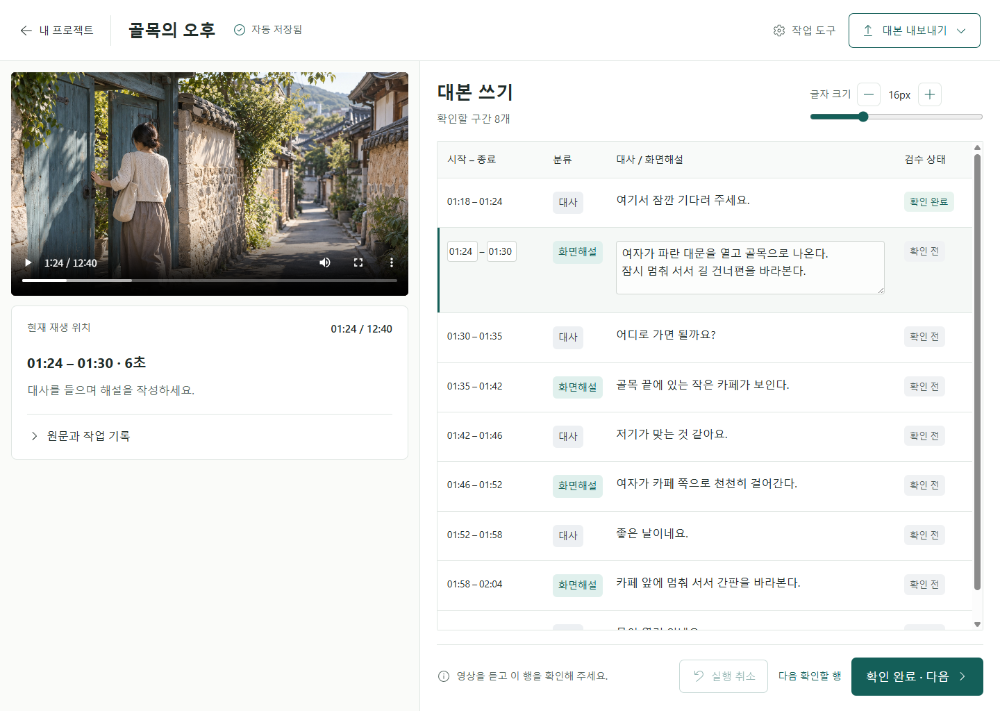

# GiNuNi Balanced Atelier 구현·검증 기록

## UI 구현 검증 당시 상태

사용자가 선택한 첫 번째 시안을 **기존 GiNuNi Windows 프로그램**에 적용했다. 새 프로그램이나 웹사이트를 만든 것이 아니다. 배포본을 보호하기 위해 `codex/atelier-ui` 별도 작업 브랜치에 구현했으며, 버전은 `0.6.0-beta.2`를 유지한다. 이 문서는 새 배포를 의미하지 않는다.

후속으로 사용자가 새 로고 적용, `main` 통합, GitHub 게시와 업그레이드 배포를 요청했다. `0.6.0-beta.3`의 브랜딩·배포 검증은 [별도 기록](2026-09-10-beta3-release-verification.md)을 따른다. 아래 수치와 이미지는 브랜딩 적용 전 UI 검증 기록으로 보존한다.



영상은 디자인 검증만을 위해 생성한 가상 자료다. 프로그램에는 이 이미지를 내장하지 않으며, 실제 작업에서는 작가가 선택한 영상을 표시한다.

## 작가에게 달라지는 부분

- 영상은 왼쪽, 대본은 오른쪽에 크게 배치한다. 영상의 가장자리를 자르지 않는다.
- `확인 완료 · 다음` 한 번으로 현재 글을 저장하고 확인을 기록한 뒤 다음 미확인 행으로 이동한다.
- 다음 문장이 화면 밖에 있으면 자동으로 보이게 한다. 큰 글씨와 최소 800×600 창에서도 확인할 문장의 시작을 드러낸다.
- 시간이나 내용에 문제가 있거나 저장에 실패하면 현재 글을 유지하고 다음 행으로 넘어가지 않는다.
- 편집·원문·AI 교정·복구·동의 설정은 `작업 도구`에 모았다. 닫았다 다시 열어도 입력 중인 선택은 유지한다.
- 내보내기 메뉴에서 **HWPX: 대사와 화면해설**, **SRT: 대사만**을 구분해 설명한다.
- 밝은 바탕과 청록색, Windows에 맞는 Fluent 아이콘을 적용했다. 사용법·설정·About도 같은 스타일로 정리했다.
- 글자 크기 11–28px 설정을 유지하고, 800px 너비에서는 공간에 맞춰 화면을 재배치한다.

## 확인한 결과

| 검사 | 결과 |
| --- | --- |
| 전체 단위 테스트 | 240개 통과, 30개 파일 |
| TypeScript / 제품 빌드 | 통과 |
| 새 작업 화면 자동 검사 | 9개 시나리오 통과 |
| 기존 검증 가능한 AI 워크플로우 | 8개 시나리오 통과 |
| 유튜브 제어 경계 검사 | 4개 통과 |
| 실제 유튜브 영상 클릭 이동 | 4개 통과 |
| 사용법 / About / Threads | 5개 통과 |
| 렌더러 미처리 오류 | 위 실행에서 0개 |
| 시각 검증 | 후속 검토 포함 3회 검증, P0/P1/P2 미해결 항목 없음 |

새 화면 검사는 초안 저장 후 승인, 잘못된 시간 입력, 빠른 두 번 클릭, 저장 실패, 모달 키보드 이동, 미저장 동의 선택 유지, 실제 HWPX/SRT 산출물, 1440/1100/800px 화면, 긴 시간값, 큰 한글, 고대비, 화면 밖의 다음 행과 맨 앞 미확인 행을 다시 보여주기를 포함한다. 기존 검사는 교정 제안 적용 후 원문 보존, 저장본 복구, 내보낸 뒤 계속 편집하기를 포함한다.

모든 앱 검사는 분리된 테스트 프로필과 합성 프로젝트에서 실행했다. 실제 작가 프로젝트·API 키를 사용하지 않았고 유료 AI 호출도 하지 않았다.

## 재현 방법

프로젝트 작업 폴더에서 `npm ci` 후 `npm run verify`를 실행한다. Playwright를 이미 사용할 수 있는 경우 `GINUNI_PLAYWRIGHT_MODULE`을 그 `index.mjs`의 절대 경로로 지정한다. 별도 설치된 런타임을 지정하는 것이므로 앱 의존성은 바뀌지 않는다.

```powershell
node scripts/qa-workflow.mjs
node scripts/qa-guide.mjs
node scripts/qa-youtube-seek.mjs
node scripts/qa-youtube-seek.mjs --live
node scripts/qa-atelier.mjs
```

`--live`만 공개 유튜브 예제에 접속한다. `qa-atelier.mjs`는 기본적으로 합성 무음 파일을 만들고, `GINUNI_QA_MEDIA`에 QA용 MP4를 지정하면 영상 구도를 함께 확인할 수 있다. `--preview`를 붙이면 별도 프로필의 앱 창을 열어 둔다. 종료는 그 창을 닫으면 된다.

`qa-compare-atelier.mjs`는 Sharp를 사용해 참조와 실제 화면을 나란히 비교한다. 외부 Sharp 설치는 `GINUNI_SHARP_MODULE`로 지정할 수 있다. 테스트 프로필과 이미지 결과는 무시된 `output/playwright` 아래에 보관한다.

## 아직 별도로 확인해야 할 것

실제 화면해설작가의 사용성 시험, Windows Narrator, 설치된 한컴오피스의 문서 표시, 서명된 설치 파일과 자동 업데이트는 이번 UI 자동 검사의 인증 범위가 아니다. GitHub 반영·버전 상승·배포는 사용자 통합 선택 후 별도로 진행한다.

자세한 시각 비교와 의도적인 차이는 저장소 루트의 `design-qa.md`에 기록했다. 기존 배포본과 사용자 작업 자료는 이 시각 검증에 사용하지 않았다.
