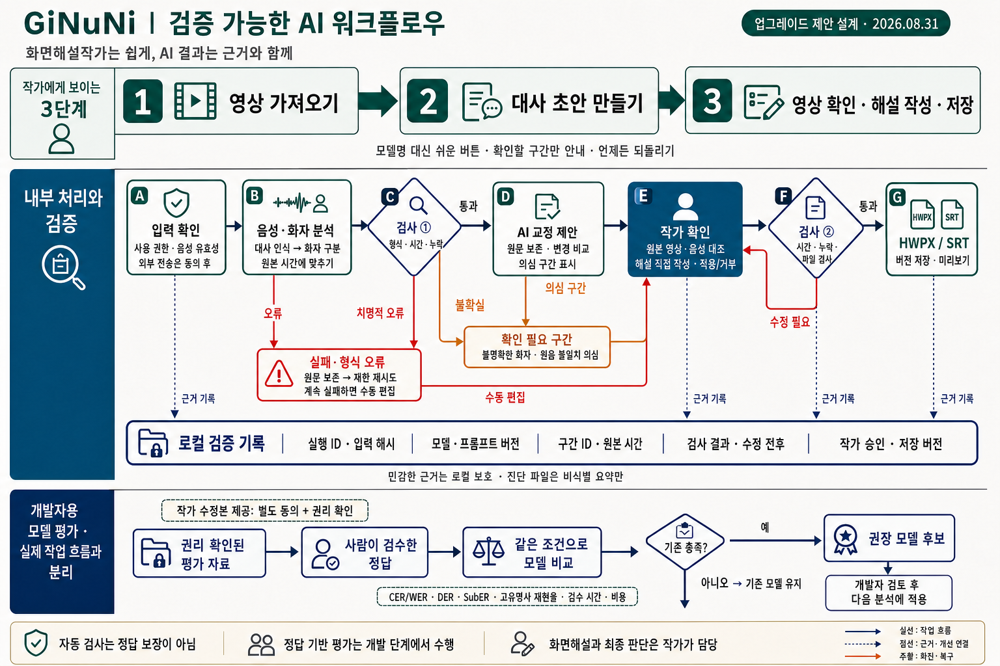

# GiNuNi 검증 가능한 AI 워크플로우 설계도

작성일: 2026-08-31
상태: 업그레이드 제안 설계 — 제품에 구현된 기능을 보여주는 화면이 아님

2026-09-09: 이 설계의 핵심 흐름을 개발 소스에 연결했다. [구현 범위와 검증 방법](../VERIFIABLE_WORKFLOW.md)을 참고한다. 아래 이미지는 설계도이며 출시 화면이나 실제 모델 정확도 측정 결과가 아니다.

## 1. 설계의 핵심

화면해설작가에게는 `영상 가져오기 → 대사 초안 만들기 → 영상 확인·해설 작성·저장`만 보여준다. 모델 선택, 오류 분류, 평가 지표와 재시도 설정은 내부 처리 또는 개발자 영역이다.

음성 인식은 이미 말해진 대사의 초안을 만든다. 영상의 시각 정보를 설명하는 **화면해설 문장은 작가가 직접 작성**하며, AI 교정 제안의 적용·거부와 납품 전 최종 판단도 작가가 담당한다.

## 2. 실제 작업 중의 확인 경로

1. **입력 확인:** 사용 권한, 재생 가능한 음성, 외부 전송 동의 여부를 확인한다. 권리 확인은 사용자의 확인·증빙 절차이며 프로그램이 자동으로 법적 권리를 판정한다는 뜻이 아니다. 권한·유효성 확인에 실패하면 분석을 시작하지 않는다.
2. **음성·화자 분석:** 대사를 인식하고 가능한 경우 화자를 구분해 원본 영상 시간에 맞춘다.
3. **검사 ①:** 결과 형식, 시간 범위, 연결된 구간, 누락 의심을 검사한다. 불확실한 화자나 원음과의 불일치 의심은 검수 목록으로 보낸다. 자동 검사만으로 모든 누락·허구 문장을 검출할 수 있다고 가정하지 않는다.
4. **AI 교정 제안:** 원문을 별도로 보존하고 교정 전후와 이유를 제시한다. 의미가 바뀌었을 가능성이 있는 제안은 작가가 원본 영상·음성을 대조한다. 별도 AI 평가 모델을 사용하더라도 참고 신호일 뿐 자동 승인 근거로 삼지 않는다.
5. **작가 확인:** 해설을 직접 작성하고 대사·화자·시간을 검수한다. 거부한 AI 제안은 적용하지 않으며, 승인 전 자동 덮어쓰기를 금지한다.
6. **검사 ②:** 시간 오류·빈 내용·출력 파일 구조를 검사한다. 오류가 있으면 작가 편집으로 되돌린다. 미검수 행 경고 정책은 기존 설계서와 동일하게 유지한다.
7. **버전 저장:** 검사 기준에 따라 HWPX/SRT를 새 버전으로 저장하고 미리보기를 제공한다. 파일 검사는 대본의 의미적 정확성을 보장하지 않는다.

## 3. 실패와 복구

- 분석 실패 또는 치명적 형식 오류가 발생해도 기존 대사·작가 작성 내용은 보존한다.
- 재시도 횟수와 비용 상한을 정하며 무한 재시도하지 않는다.
- 공급자 전환이나 클라우드 재전송은 사용자에게 알리지 않고 실행하지 않는다.
- 계속 실패하면 수동 편집으로 작업을 이어갈 수 있게 한다. 입력 영상 자체를 열 수 없는 경우에는 먼저 입력 문제 해결을 안내한다.
- 내보내기 오류는 작가 편집으로 돌려보내며, 복구용 스냅샷으로 이전 상태를 되돌릴 수 있게 한다.

## 4. 검증 근거와 개인정보

프로젝트 내부에서 다음 연결을 보존하는 설계다.

| 근거 | 확인할 수 있는 내용 |
| --- | --- |
| 실행 ID·입력 해시 | 어느 입력에 대한 어느 실행인지 |
| 모델·프롬프트 버전 | 어떤 설정으로 초안을 만들었는지 |
| 구간 ID·원본 시간 | 대사와 원본 영상의 어느 구간이 연결되는지 |
| 검사 결과·수정 전후 | 어떤 문제가 발견됐고 무엇을 바꿨는지 |
| 작가 승인·저장 버전 | 누가 언제 승인했으며 어떤 버전을 내보냈는지 |

이 기록은 **민감한 프로젝트 자료로 로컬에서 보호**한다. 일반 로그·문의용 진단 파일에 대사, 오디오, API 키, 전체 경로를 복제하지 않는다. 해시는 입력 동일성의 근거이지, 모델 결과가 옳다는 증명은 아니다.

## 5. 정답 기반 모델 평가는 별도 과정

실제 작업 중 오류 검사와 개발 단계의 모델 평가를 분리한다.

`권리 확인된 평가 자료 → 사람이 검수한 정답 → 같은 조건으로 모델 비교 → 기준 충족 여부 → 권장 모델 후보`

- CER/WER, DER, SubER, 고유명사 재현율은 필요한 정답 주석이 있는 별도 평가 세트에서 계산한다.
- 정답 대본이 없는 실제 작업 파일에 대해 이 지표를 정답 정확도처럼 표시하지 않는다.
- 작가 검수 시간, 처리 시간, 실패율, 비용도 같은 평가 조건에서 비교한다.
- 프로그램·화자·장면이 겹쳐 평가 결과가 부풀려지지 않도록 조정용 자료와 최종 평가 자료를 구분한다.
- 기준을 충족하지 못하면 기존 모델을 유지한다. 충족하더라도 개발자가 검토한 뒤 다음 분석의 선택지에 반영한다.
- 작가 수정본을 평가 자료로 제공하는 경우 **별도 동의와 권리 확인**을 먼저 받는다. 수정했다고 자동 전송·학습하지 않는다.

## 6. 이미지 검토 결과

- 작가 흐름과 개발자 평가를 별도 영역으로 구분했다.
- 불확실 결과는 작가 검수로, 실패 결과는 제한 재시도·수동 편집으로 연결했다.
- 내보내기 검사 실패가 작가 편집으로 돌아오는 경로를 포함했다.
- 모델 평가의 통과가 대본 자동 승인으로 연결되지 않도록 했다.
- 이미지의 목표·검사 표현은 설계 요구사항이며, 구현 완료 또는 정확도 보장 주장이 아니다.

## 관련 문서

- [화면해설작가 중심 업그레이드 설계](../superpowers/specs/2026-08-29-writer-first-upgrade-design.md)
- [12주 개발 로드맵과 구현 계획](../superpowers/plans/2026-08-29-writer-first-upgrade.md)
- [이미지 생성 프롬프트와 수정 기록](2026-08-31-verifiable-ai-workflow-prompts.md)
